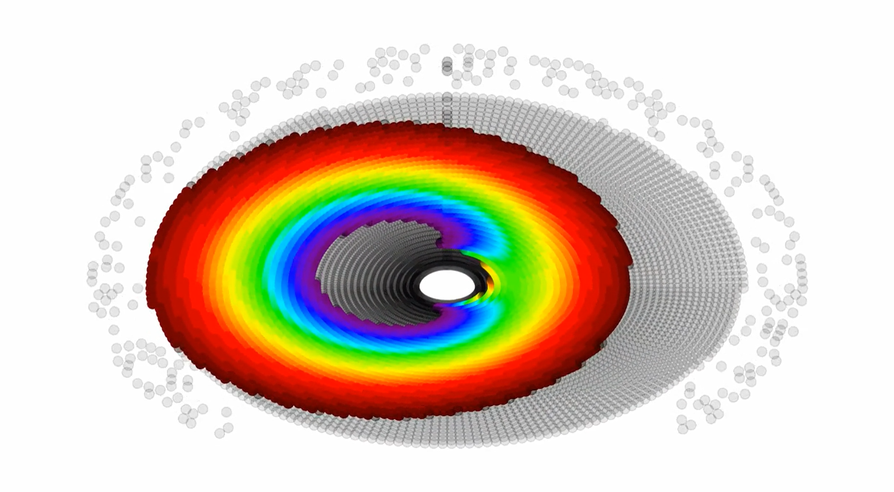

# MoviTon

This is the worknig version of a geodesic raytracer for black holes I wrote all the way back in 2018 - back then, I tried to emulate rantonels' STARLESS, but I kept working on it on-and-off and produced this result.

MoviTon raytraces photon paths in Kerr spacetime, and can produce 2D and 3D animations of Kerr black holes. it does this by splitting photon trajectories into 6 first-order differential equations which are then solved with the RK4 method. ```Matplotlib``` is used to generate the output frames, which are then saved individually. ```moviepy``` then combines these frames and converts them into an mp4 video. Axes and their titles can be toggled on and off by rearranging the positions of the ``setVisible()`` function lines in ``RayTracer.py``'s ``image()`` function.

MoviTon, by default, is set to produce videos of both Kerr and 'Newtonian' black holes with accretion disks viewed from different angles - specifically from 0 to 89.5 degrees as the camera pitches. This can all be changed in ``run.py``, and changing it is in fact encouraged. The technical details of how this was achieved is in the attached report.

To run the program, make sure you have the ``os``, ``platform``, ``sys``, ``numpy``, ``scipy``, ``matplotlib``, ``glob``, ``pillow``, and ``moviepy`` Python3 packages installed. Make sure you have a C++ compiler as well. To run the entire raytracer, copy the two ``.py`` files and the ``.cpp`` file to the same directory. In that directory, run ``python run.py``. Now take a break for around half a day - the raytracer computes 10000 photons per frame and 180 frames in total are generated by default. It's advised that you start the raytracer and leave it running overnight. To change the total number of photons computed, modify the ``radial_photons`` and ``axial_photons`` variables in ``RayTracer.py``. 

It is highly encouraged to fork and modify this program to implement multiprocessing, multithreading, and in general speed it up. Python is a slow language, and the majority of this code comes from a time where I was even more of a novice than I currently am in Python and C++. 

This package will work on Windows, but you may need to change some file calling paths in ``RayTracer.py``. One set of videos is in the provided folder.

Example output: Kerr Spacetime w/ only visible components (heavily stylized)

